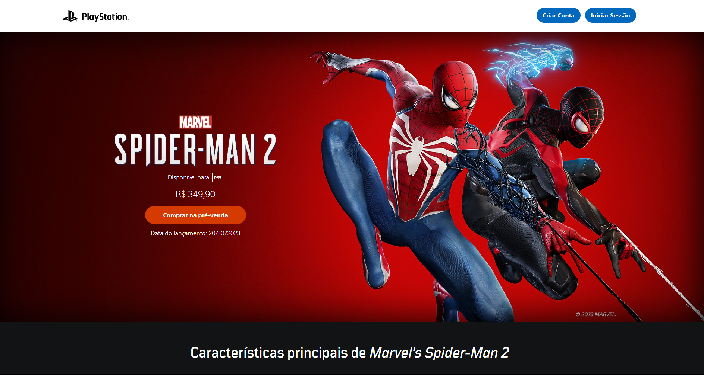

<h1 align="center">
  Spider-Man 2
</h1>

## 📷 Deploy

<h3>LINK: https://spider-man-2-gamma.vercel.app</h3>

## 💻 Projeto
Projeto próprio, onde consegui aplicar os conhecimentos adquirido durante o módulo para criação de uma landing page do game Spider-Man 2. Utilizado como projeto de conclusão de módulo na EBAC - Escola Britânica de Artes Criativas e Tecnologia.

## 🚀 Tecnologias
- JavaScript
- Sass
- Gulp
- HTML
- CSS
